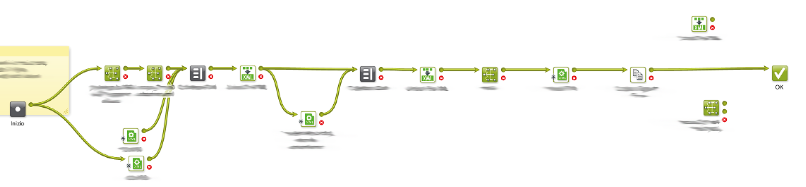

# AE-Layout-Improver

---

### Better &amp; customizable layout improver for Esko Automation Engine

---

The standard AE layout builder it's a very strong and adaptable tool made for packaging industries. Useful to shorthen the time between the realization of the single ARD design and the MFG layout. It even works without server license avaible. 

Despite this AE Layout isn't very adaptable to an industry that don't use pre-cut paper/corrugated and not very customer-friendly due to a high technical skill required to create or read exportation file.

I created these script to solve this problems.

In the picture below you can see (partial) example of the flow where i apllied AE-Layout-Improver.

A script to correct insertion errors on the ERP side and an easy-to-read and interactive final export in HTML complete the workflow
